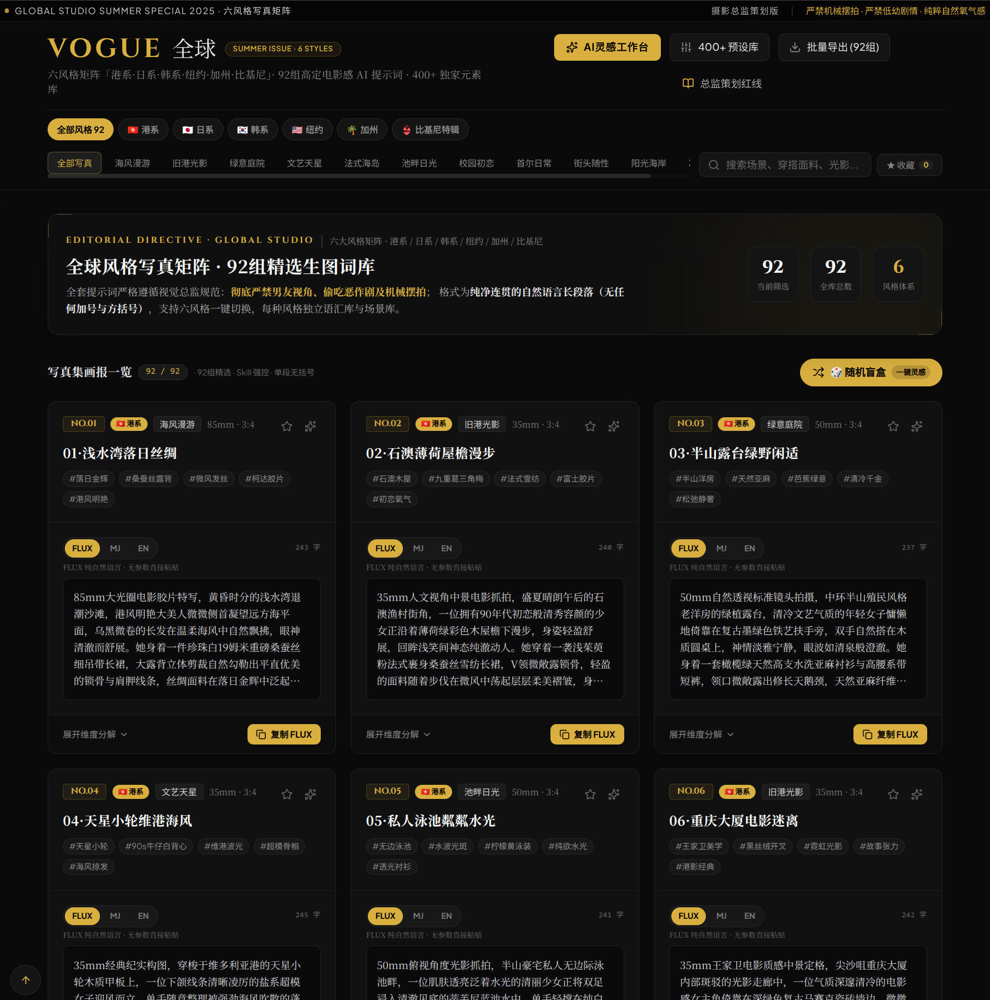

# 全球风格写真矩阵 · Global Style Photobook Studio

<p align="center">
  <a href="https://github.com/aifeifei798/global-style-photobook-studio">
    
  </a>
  
  
  
  
</p>

<p align="center">
  <b>港系 / 日系 / 韩系 / 纽约 / 加州 / 比基尼特辑 · 六风格 AI 时尚写真提示词策划工厂</b><br>
  专为 FLUX.1 / Midjourney / SDXL / 即梦 等次世代生图引擎打造，告别碎词堆叠，直出单一连贯自然语言段落。
</p>

<p align="center">
  
  <br>
  <em>▲ 六风格矩阵 · 92组精选 · 400+预设 · Skill强控 · FLUX/MJ/EN 一键切换与随机盲盒</em>
</p>

---

## ✨ 核心特性

- **📸 六大纯正美学矩阵**：覆盖港风复古、日系柔焦、韩系冷调、纽约街头、加州阳光与夏日比基尼特辑。
- **🔄 多模型格式一键切换**：
  - **FLUX**：连贯中文自然语言流，极致契合 FLUX.1 / 即梦 / 混元 等 DiT 架构。
  - **Midjourney**：英文自然语言 + 自动注入 `--ar {aspectRatio} --v 6.1 --style raw` 参数。
  - **EN 模式**：纯净英文段落，适配 SDXL / DALL-E 3。
- **🎲 灵感盲盒系统 (Blind Box)**：
  - **全局一键灵感**：顶部胶囊一键全矩阵随机抽卡，自动置顶 Feed 流。
  - **工作台碰撞**：支持弹窗内一键成图或仅随机表单参数。
- **🛡️ 严苛美学红线 (SkillGuard)**：
  - 杜绝传统 `[ ]` 方括号、`+` 加号与机械摆拍词。
  - 严禁油腻偷拍/低俗视角，比基尼特辑严格锁定“颜色/款式/材质/海岸线”四要素。
- **⚡ 优雅降级**：未配置 OpenAI API Key 时自动降级为本地确定性拼接引擎，离线完全可用。
- **📦 庞大灵感资产**：内置 **374 组**专业预设（近 400，`hk 200 / jp 40 / kr 32 / ny 32 / ca 32 / bikini 38`）、**92** 组精选写真词，支持 TXT / MD / JSON / CSV 批量导出。

---

## 🎨 六风格矩阵

| 风格 | 代号 | 美学定调 | 色板 | 代表场景 |
| :--- | :--- | :--- | :--- | :--- |
| 🇭🇰 **港系** | `hk` | 清冷微甜 · 氧气感 · 港片褪色暖调 | `#d4af37` | 浅水湾 · 石澳 · 天星小轮 · 重庆大厦 |
| 🇯🇵 **日系** | `jp` | 温柔青涩 · 棉花糖氧气感 · 柔焦奶油散景 | `#f0a6b5` | 樱花道 · 图书馆窗光 · 便利店暖光 |
| 🇰🇷 **韩系** | `kr` | 氛围感 · MZ冷调 · 赛璐璐光泽 | `#8ecae6` | 圣水洞 · 弘大霓虹 · 汉江野餐 |
| 🇺🇸 **纽约** | `ny` | 美式自信 · 街头随性 · 高对比时装调 | `#ff595e` | 第五大道 · 苏活区 · 高线公园 |
| 🌴 **加州** | `ca` | 阳光灿烂 · 邻家真实 · 小麦肌 | `#ffb703` | Santa Monica · Venice · Malibu |
| 👙 **比基尼** | `bikini` | 日系夏日女友 · 严格遵循 4 要素规范 | `#ff8fab` | 冲绳 · 湘南 · 伊豆 · 镰仓 · 静冈 |

> 📌 **比基尼特辑**：每条必含 **颜色 / 款式 / 材质 / 日本海岸线**，5 条海岸线各 10 组精选。

---

## 📝 提示词输出范例 (Output Examples)

<details>
<summary><b>🇨🇳 FLUX 纯自然语言模式（点击展开）</b></summary>

> 浅水湾午后微风，港片褪色暖黄与青绿胶片色调。年轻女子侧身倚在老式栏杆旁，清冷微甜神情，发丝随海风轻扬。身着墨绿色复古丝绒吊带裙与薄针织开衫，阳光在锁骨与微卷发丝上勾勒出柔和边缘光。35mm 胶片镜头半身构图，背景浅水湾海浪与远山自然虚化，颗粒感细腻，透出 90 年代港风电影的从容呼吸感。

</details>

<details>
<summary><b>🇺🇸 Midjourney 摄影级格式（点击展开）</b></summary>

> Afternoon breeze at Repulse Bay with faded warm-amber and cyan film tones. A young East Asian woman leaning against a vintage railing, cool yet sweet expression, hair gently stirred by sea breeze, wearing an emerald velvet slip dress with a thin cardigan, soft rim lighting contouring her shoulders. 35mm film lens, waist-up composition, creamy bokeh of distant coastline and waves, fine analog grain --ar 3:4 --v 6.1 --style raw

</details>

---

## 🚀 快速开始

### 运行环境
- Node.js 18+
- npm / pnpm / yarn

### 安装与启动

```bash
# 1. 克隆项目
git clone https://github.com/aifeifei798/global-style-photobook-studio.git
cd global-style-photobook-studio

# 2. 安装依赖
npm install

# 3. 环境变量配置
cp .env.example .env
# 或 cp .env.example .env.local （.env / .env.local 均会被 dotenv 自动加载）
```

在 `.env` 中填入你的配置：
```env
OPENAI_API_KEY=sk-...
OPENAI_MODEL=gpt-4o-mini
# OPENAI_BASE_URL=https://api.openai.com/v1  # 可选中转地址
# APP_URL=http://localhost:3000              # 可选
# PORT=3000                                  # 可选，默认 3000
```

```bash
# 4. 开发与构建
npm run dev      # 启动开发服务器：http://localhost:3000
npm run build    # 生产构建 (Vite + esbuild -> dist/)
npm start        # 启动生产服务
```

---

## 🔌 API 接口规范

| 方法 | 路径 | 说明 | 请求体 / 响应 |
| :--- | :--- | :--- | :--- |
| `GET` | `/api/health` | 服务健康检查 | `{ status, hasOpenAIKey, model, supportedStyles, skillVersions }` |
| `GET` | `/api/styles` | 获取六大风格元数据 | 返回风格色板、标签、场景与 `skill` 版本 |
| `POST` | `/api/generate-prompt` | 生成写真提示词（Skill 强控） | `body: { style, theme, beautyType, outfit, location, composition, lighting, focalLength, filmTone, aspectRatio, customKeywords }` → `data: { promptZh, promptEn, skill, skillValid, skillErrors }` |
| `POST` | `/api/validate-prompt` | Skill 合规自检 | `body: { style, promptZh, promptEn }` → `{ valid, errors, cleanedZh, skill }` |

> 💡 **离线降级保障**：后端未检测到 `OPENAI_API_KEY` 时，接口会自动调用确定性语法生成器，保证核心功能 100% 离线可用。

---

## 📁 目录结构

```text
├── server.ts                   # Express + Vite SSR/API 服务入口（已集成 dotenv）
├── server/
│   ├── stylePrompts.ts         # 六风格 SystemPrompt（SKILL §1-8 完整嵌入）
│   └── skillGuard.ts           # SkillGuard 校验层（红线/结构/比基尼四要素/自检与自动纠错）
├── src/
│   ├── components/             # UI 组件库 (PromptCard, GeneratorModal, Library 等)
│   ├── data/
│   │   ├── styleConfig.ts      # 风格元数据与色彩规范（6 色板）
│   │   ├── presets_*.ts        # 374 组专业预设（hk 200 / jp 40 / kr 32 / ny 32 / ca 32 / bikini 38）
│   │   ├── curated_*.ts        # 92 组精选提示词库（分风格）
│   │   └── curatedAll.ts       # 统一聚合导出
│   └── utils/
│       └── formatPrompt.ts     # FLUX 纯自然语言 / MJ --ar --v 6.1 / EN 翻译 三格式转化器
├── dist/                       # 生产产物（vite 532KB + server.cjs 46KB）
└── package.json                # v1.1.0 / global-style-photobook-studio
```

---

## 📄 许可证

本项目基于 [MIT License](LICENSE) 开源。  
Skills 语汇库源自 `opencode-visual-config` 七风格工作坊。
